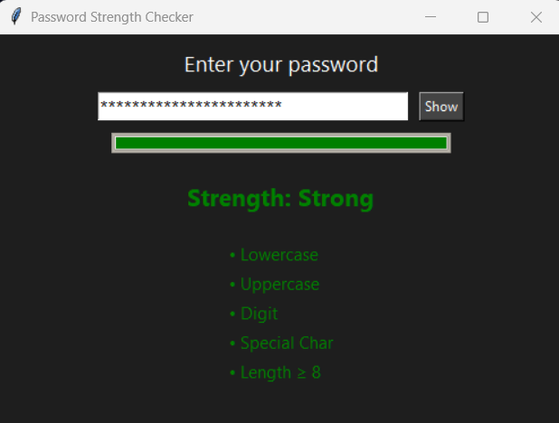

# 🔐 Password Strength Checker

A simple yet powerful Python GUI app that checks the strength of passwords using real-time feedback and regex rules.




---

## 🚀 Features

- GUI with Tkinter
- Real-time password strength feedback
- Criteria checks (uppercase, lowercase, digits, symbols, length)
- Progress bar with color indicators
- Password visibility toggle

---

## 🛠 Tech Stack

- Python 3
- Tkinter
- Regex

---

## 📦 How to Run

1. Clone the repo:
   ```bash
   git clone https://github.com/your-username/password-strength-checker.git
   cd password-strength-checker
